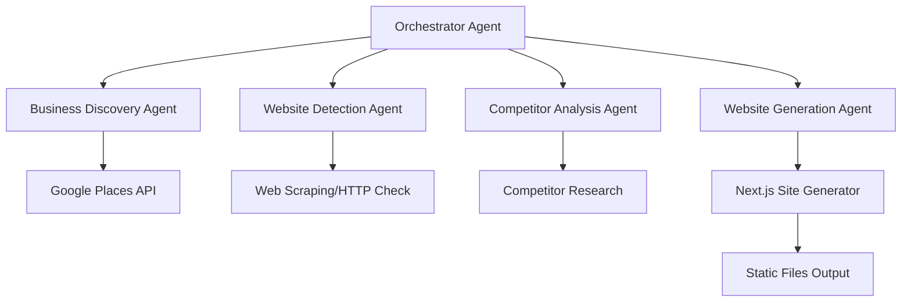

# Multi-Agent Business Website Generator

## Architecture Overview

The system uses a LangChain-based multi-agent architecture with specialized agents for each task:




## Project Structure

```javascript
DeepAgent/
├── src/
│   ├── agents/
│   │   ├── __init__.py
│   │   ├── orchestrator.py          # Main orchestrator agent
│   │   ├── business_discovery.py    # Finds businesses via Google Places
│   │   ├── website_detector.py      # Checks for existing websites
│   │   ├── competitor_analyzer.py   # Analyzes competitor websites
│   │   └── website_generator.py    # Generates Next.js site
│   ├── services/
│   │   ├── __init__.py
│   │   ├── google_places.py         # Google Places API client
│   │   ├── website_checker.py      # Website existence checker
│   │   └── content_generator.py    # LLM-based content generation
│   ├── generators/
│   │   ├── __init__.py
│   │   ├── nextjs_generator.py     # Next.js site structure generator
│   │   └── templates/              # Next.js template files
│   ├── models/
│   │   ├── __init__.py
│   │   └── business.py             # Business data models
│   ├── utils/
│   │   ├── __init__.py
│   │   └── config.py               # Configuration management
│   └── main.py                     # Entry point
├── generated_sites/                 # Output directory for generated sites
├── requirements.txt
├── .env.example
└── README.md
```


## Implementation Plan

### 1. Project Setup and Dependencies

- Create Python project structure with virtual environment
- Install dependencies: `langchain`, `langchain-openai`, `langchain-community`, `googlemaps`, `requests`, `beautifulsoup4`, `jinja2`
- Set up configuration management for API keys and settings
- Create `.env.example` with required API keys

### 2. Core Models and Data Structures

**File: `src/models/business.py`**

- Define `Business` model with fields: name, address, phone, industry, city, website_url, has_website, google_place_id, reviews, rating
- Define `CompetitorAnalysis` model for competitor data
- Define `WebsiteRequirements` model for generation parameters

### 3. Google Places Integration

**File: `src/services/google_places.py`**

- Implement `GooglePlacesService` class
- Methods: `search_businesses(industry, city, state)` - returns list of businesses
- Handle API rate limiting and error handling
- Extract business details: name, address, phone, website, reviews, rating

### 4. Website Detection Agent

**File: `src/agents/website_detector.py`**

- LangChain agent that checks if a business has a website
- Uses `WebsiteCheckerService` to:
- Check if website URL exists in Google Places data
- Verify URL accessibility via HTTP request
- Detect if URL is just a Google Business Profile link
- Returns boolean `has_website` flag

### 5. Business Discovery Agent

**File: `src/agents/business_discovery.py`**

- LangChain agent that orchestrates business discovery
- Uses `GooglePlacesService` to search for businesses
- Filters by industry keywords and location
- Returns list of `Business` objects

### 6. Competitor Analysis Agent

**File: `src/agents/competitor_analyzer.py`**

- LangChain agent that analyzes competitors
- Finds top-rated businesses in same industry/location with websites
- Uses LLM to extract:
- Key services offered
- Content structure and messaging
- SEO keywords and strategies
- Design patterns and best practices
- Returns `CompetitorAnalysis` object with insights

### 7. Website Generation Agent

**File: `src/agents/website_generator.py`**

- LangChain agent that generates website content and structure
- Uses LLM to create:
- Business description and about content
- Service descriptions
- SEO-optimized meta tags and content
- Call-to-action text
- Integrates with `NextJSGenerator` to create file structure

### 8. Next.js Site Generator

**File: `src/generators/nextjs_generator.py`**

- Generates complete Next.js project structure:
- `package.json` with dependencies
- `next.config.js` configuration
- `tailwind.config.js` for styling
- Pages: `index.tsx`, `about.tsx`, `services.tsx`, `contact.tsx`
- Components: `Header.tsx`, `Footer.tsx`, `ServiceCard.tsx`
- SEO components with meta tags
- Responsive, modern UI using Tailwind CSS
- Uses Jinja2 templates for dynamic content injection
- Outputs to `generated_sites/{business_name_slug}/`

### 9. Orchestrator Agent

**File: `src/agents/orchestrator.py`**

- Main agent that coordinates all other agents
- Workflow:

1. Receive input: industry, city, state
2. Call Business Discovery Agent
3. Call Website Detection Agent for each business
4. Filter businesses without websites
5. For each business without website:

    - Call Competitor Analysis Agent
    - Call Website Generation Agent
    - Generate Next.js site
- Returns list of generated site paths

### 10. Main Entry Point

**File: `src/main.py`**

- CLI interface using `argparse` or `click`
- Accepts parameters: `--industry`, `--city`, `--state`, `--limit`
- Initializes LangChain with OpenAI (or configurable LLM)
- Runs orchestrator agent
- Displays results and generated site locations

### 11. Configuration and Environment

**File: `src/utils/config.py`**

- Load environment variables
- Validate required API keys
- Configuration for:
- LLM provider and model
- Google Places API settings
- Output directory
- Default website templates

## Key Technologies

- **LangChain**: Agent framework and orchestration
- **OpenAI/Anthropic**: LLM for content generation and analysis
- **Google Places API**: Business discovery
- **Next.js**: Generated website framework
- **Tailwind CSS**: Styling for generated sites
- **Jinja2**: Template engine for site generation

## Agent Communication Pattern

Agents use LangChain's agent executor pattern with:

- Tool definitions for API calls and services
- Prompt templates for agent instructions
- Memory/state management for context passing
- Error handling and retry logic

## Output

Generated Next.js sites will be:

- SEO-optimized with proper meta tags
- Responsive and modern design
- Multi-page structure (home, about, services, contact)
- Ready for static export and deployment
- Includes business information from Google Places
- Content generated based on industry and competitor analysis

## Next Steps After Generation

Users can:

1. Review generated site in `generated_sites/`
2. Customize content and styling as needed